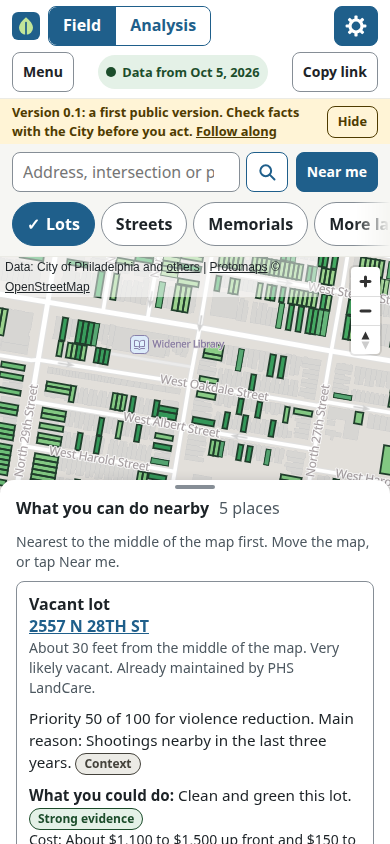
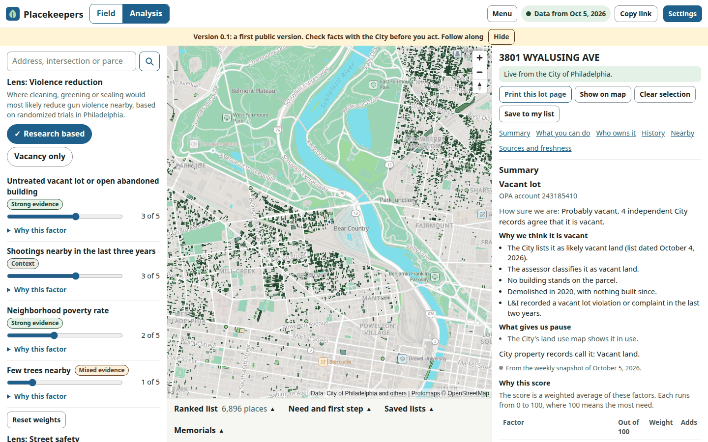
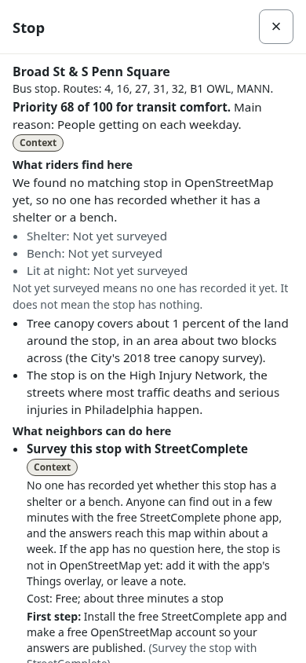

# Placekeepers

A free, public map that helps Philadelphia neighbors and organizers find vacant lots and
dangerous streets, and the lawful way to do something about them.

**Live site:** https://holdthedoorhoid.github.io/placekeepers/

## Who it is for

Placekeepers is built for two kinds of people, often on the same block: a **neighbor** standing on
the street with a phone, who wants to know what they can do about the empty lot on the corner, and
an **organizer** at a desk, who wants to compare many places at once and find where care would help
most. Both share the same map, settings and links, so a link one person copies opens the same thing
for the other.

Placekeepers revives [Clean & Green Philly](https://github.com/CodeForPhilly/clean-and-green-philly),
a Code for Philly project that closed in 2025 when the City's vacancy data stopped being reliable.
We combine many City records on purpose, so no single broken source can take the map down again.
Read [Why this works](https://holdthedoorhoid.github.io/placekeepers/why/) for the Philadelphia
research behind it.

## What you can do with v0.3

**On your phone, on the block.** Search an address or tap "Near me" to see "What you can do
nearby": the closest lots and streets that could use care, each with why it matters, how sure we
are, and the first lawful step.

**At a desk, across the city.** Blend the violence reduction and street safety lenses with
sliders, filter the map, sort a ranked list, see a plot of need against how hard a place is to get
permission for, download the results as CSV or GeoJSON, and save lists that stay in your own
browser.

**Every lot's own page.** Who owns it and their mailing address, as the City publishes them;
every sale on record; flags such as an absentee owner or a possible estate, each written with what
it means, why to be careful, and a protective next step; and the first lawful step to get
permission.

**Street safety and memorials.** The High Injury Network, years of crash records, and a quiet
marker for each person the Police record as killed while walking, cycling or riding a scooter.

**Transit comfort.** Every SEPTA bus and trolley stop and route, scored for where a shelter, a
bench or shade would help riders most, with a suggestion and its first lawful step at each stop.
Switch it on with the "Bus stops" chip, or "Buses and trains" in Settings. The "Survey bus stops"
guide and the printable "Survey a route" kit show how to help map what OpenStreetMap does not
know yet.

**Heat and shade.** A lens for where planting trees or greening a lot would cool people most, with
its own suggestions, plus the City's trees, neighborhood heat vulnerability and the floodplain.

**Placemaking.** A lens for where a vacant lot would most likely become a place people use every
day: many neighbors and everyday places within a short walk, far from a park, no public art nearby.
Its suggestions are a place to sit in the shade, a community garden, a mural, and reports of
dumping, a dark street light or graffiti to Philly311. It is about use and welcome, never about
crime. Walkability, people and places within walking distance, and traffic stress for people on
bikes are layers of their own, and so is public art from the City, OpenStreetMap and Wikidata.

**Displacement watch.** Census tracts where public records show signs that prices are rising. It
changes no score. Inside one, greening and placemaking suggestions add ways to protect the
neighbors who live there now.

**Lots listed as available, and parking problems.** Show only the lots the City's land agencies
list as available, with the side yard program first where the lot is eligible and no prices. A
heat map of parking problems reported with Philly Bike Action's Laser Vision app, shown with its
permission, as evidence for fixing the street itself.

Also benches, water, toilets, libraries, recreation centers and pools, and 311 reports of dumping,
dark streetlights and graffiti, without a lens of their own. Every layer, score and suggestion can
be switched on or off in Settings.

## What it does not do yet

Names of people killed are not shown. We want the Bicycle Coalition and Families for Safe Streets
to weigh in first. Removal requests go through a public GitHub issue for now; a private email
address is planned.

A fuller lot history, historic maps, Land Bank statistics and organizing tools are planned for
later releases. Transit Forward Philadelphia's stop audits wait on permission, and
philart.net, the Association for Public Art and Philadelphia's Magic Gardens wait on theirs. See the
[roadmap](docs/ROADMAP.md).

## How the data stays fresh

Every Monday, GitHub downloads every source again, checks it, and keeps the last good copy of
anything that fails, clearly labeled with its age. The
[Data status page](https://holdthedoorhoid.github.io/placekeepers/status/) shows where every
source stands right now.

## Using it responsibly

Placekeepers publishes facts that can help a neighbor and, in the wrong hands, could hurt one. We
warn people rather than hide information, and design the site so the responsible choice is the
easy one. Read [Use this responsibly](https://holdthedoorhoid.github.io/placekeepers/responsibly/)
on the site, or the full rules in [docs/ETHICS.md](docs/ETHICS.md).

## Credit

Placekeepers continues the idea behind Clean & Green Philly, built by volunteers at Code for
Philly from 2023 to 2025, and credits it throughout. It reuses none of that project's code today,
but does use its final snapshot of parcel tax debt from July 2025 (MIT license), credited on the
Data status page. If any of its code is reused later, that code will keep the project's MIT
notice in the file header and be listed in a NOTICE file, as the project's own rules require. No
NOTICE file is needed until then.

Map data comes from the City of Philadelphia and other public sources. Transit schedules and
ridership come from SEPTA, under its open data license agreement. Shelters, benches and much of the
public art come from OpenStreetMap and its contributors, under the Open Database License, the same
source behind the base map. Walkability comes from the EPA, traffic stress from the Delaware Valley
Regional Planning Commission, and parking problems from Philly Bike Action's Laser Vision app, with
its permission. Every source, with its publisher and license, is listed on the
[Data status page](https://holdthedoorhoid.github.io/placekeepers/status/) and in
[docs/DATA_SOURCES.md](docs/DATA_SOURCES.md).

## How to help

- **Add missing map features**, such as benches or bus shelters, to OpenStreetMap. We read it
  every week.
- **Report a correction** through a short, prefilled
  [GitHub issue](https://github.com/holdTheDoorHoid/placekeepers/issues/new/choose).
- **Ask a question or raise a concern** on the
  [Contact page](https://holdthedoorhoid.github.io/placekeepers/contact/).

## License

- Code: the GNU General Public License, version 3 or later.
- Published data: the Open Database License where OpenStreetMap data is included, otherwise each
  source's own terms, such as the MIT licensed Clean & Green Philly tax snapshot (see
  [docs/DATA_SOURCES.md](docs/DATA_SOURCES.md)).
- Written guides, including this file: Creative Commons Attribution ShareAlike 4.0.

Read the full [LICENSE](LICENSE).

## Screenshots

The field view on a phone, near a block with vacant lots, with "What you can do nearby" open:



The analysis view on a desktop, with a lot page open:



The transit comfort lens on a phone, with a stop's details open near Broad Street:



## For developers

```
registry/        shared YAML registry: sources, layers, lenses, suggestions, routes
pipeline/        Python data pipeline, with tests and fixtures
web/             the Svelte map and site
content/         the site's plain language pages, in Markdown
data/curated/    hand maintained files, such as memorials
docs/            design, safeguards, roadmap, contracts and research
.github/         workflows and issue forms
```

**Run the pipeline** (Python 3.12):
```
python3.12 -m venv pipeline/.venv
pipeline/.venv/bin/pip install -e "pipeline[dev]"
pipeline/.venv/bin/pk registry check
```
`pk all` fetches every source, builds the map, and publishes it; see
[pipeline/README.md](pipeline/README.md) for every command. It needs
[tippecanoe](https://github.com/felt/tippecanoe) for map tiles; without it, the pipeline writes
GeoJSON instead and says so.

**Run the web app** (Node 24):
```
cd web
npm ci
npm run dev
```

**Tests:**
```
cd pipeline && .venv/bin/pytest
cd web && npm test && npm run check
```

File formats shared between the pipeline and the web app are documented in
[docs/CONTRACTS.md](docs/CONTRACTS.md). Read [docs/DESIGN.md](docs/DESIGN.md) before changing how
the map decides anything, and [docs/ETHICS.md](docs/ETHICS.md) before changing what it shows about
an owner, a victim or a shooting.

Placekeepers is not affiliated with the City of Philadelphia and is not legal advice.
